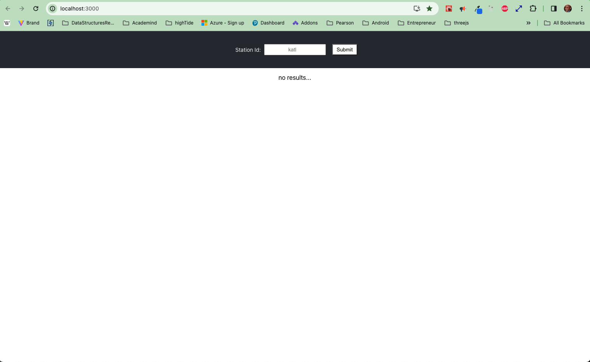

# Weather API
### Author:  Tony Lockhart

## Installation:
1. Open a terminal
1. cd gtriWeatherApp
1. run "npm install"
1. run "npm start" (npm run start:backend)
1. Open a seperate terminal
1. cd gtriWeatherApp/client/src/assets
1. run "sass --watch scss/custom:scss --no-source-map scss/style.scss:css/style.css"

## Screenshots
### Screenshot 1

### Screenshot 2
